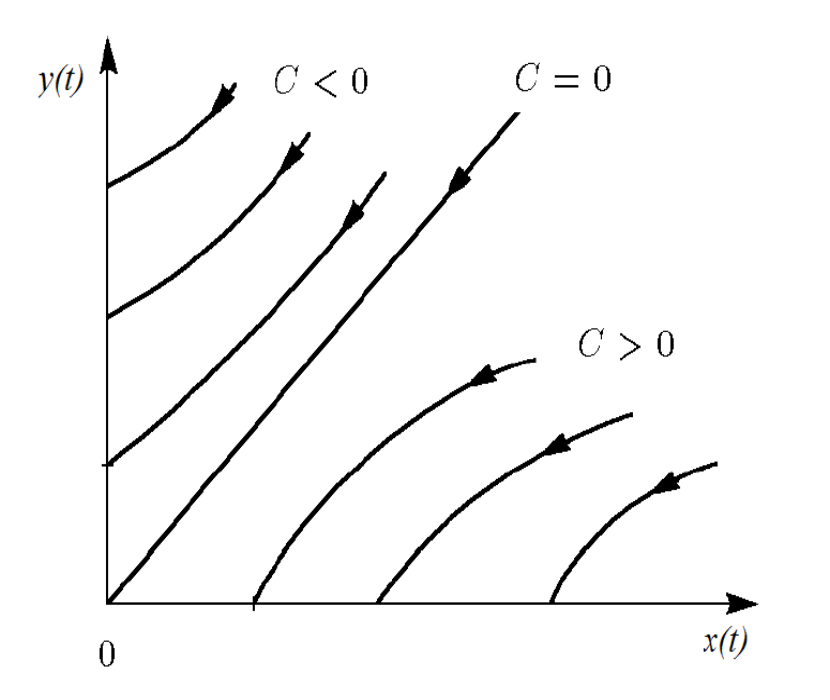
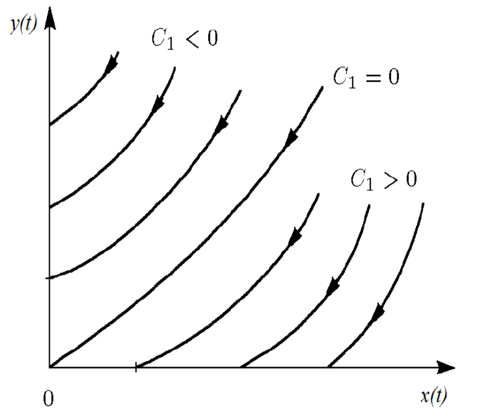
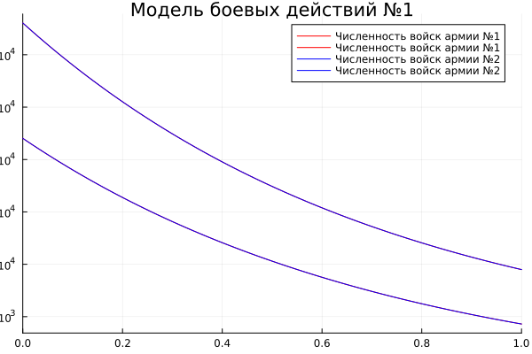

---
## Front matter
title: "Отчёт по лабораторной работе 3"
subtitle: "НКНбд-01-21"
author: "Юсупов Эмиль Артурович"

## Generic otions
lang: ru-RU
toc-title: "Содержание"

## Bibliography
bibliography: bib/cite.bib
csl: pandoc/csl/gost-r-7-0-5-2008-numeric.csl

## Pdf output format
toc: true # Table of contents
toc-depth: 2
fontsize: 12pt
linestretch: 1.5
papersize: a4
documentclass: scrreprt
## I18n polyglossia
polyglossia-lang:
  name: russian
  options:
	- spelling=modern
	- babelshorthands=true
polyglossia-otherlangs:
  name: english
## I18n babel
babel-lang: russian
babel-otherlangs: english
## Fonts
mainfont: PT Serif
romanfont: PT Serif
sansfont: PT Sans
monofont: PT Mono
mainfontoptions: Ligatures=TeX
romanfontoptions: Ligatures=TeX
sansfontoptions: Ligatures=TeX,Scale=MatchLowercase
monofontoptions: Scale=MatchLowercase,Scale=0.9
## Biblatex
biblatex: true
biblio-style: "gost-numeric"
biblatexoptions:
  - parentracker=true
  - backend=biber
  - hyperref=auto
  - language=auto
  - autolang=other*
  - citestyle=gost-numeric
## Pandoc-crossref LaTeX customization
figureTitle: "Рис."
tableTitle: "Таблица"
listingTitle: "Листинг"
lofTitle: "Цель Работы"
lotTitle: "Ход Работы"
lolTitle: "Листинги"
## Misc options
indent: true
header-includes:
  - \usepackage{indentfirst}
  - \usepackage{float} # keep figures where there are in the text
  - \floatplacement{figure}{H} # keep figures where there are in the text
---

# Введение

Во время выполнения лабораторной работы мы рассмотрим простейшую модель боевых действий - модель Ланчестера

# Задание 

Вариант заданий попался по принципу [номер студенческого билета mod кол-во вариантов заданий = 36]

Между страной Х и страной У идет война. Численность состава войск
исчисляется от начала войны, и являются временными функциями x(t) и y(t). В начальный момент времени страна Х имеет армию численностью 22 022 человек, а в распоряжении страны У армия численностью в 33 033 человек. Для  упрощения модели считаем, что коэффициенты a, b, c, h постоянны. Также считаем P(t) и Q(t) непрерывные функции.

Постройте графики изменения численности войск армии Х и армии У для следующих случаев:

1. Модель боевых действий между регулярными войсками

$\left\{ \begin{array}{cl}
 \frac{dx}{dt} = -0.401x(t) -0.707y(t) + sin(8t)\\
 \frac{dy}{dt} = -0.606x(t) - 0.502y(t) + cos(6t)
\end{array} \right.$

2. Модель ведение боевых действий с участием регулярных войск и партизанских отрядов

$\left\{ \begin{array}{cl}
 \frac{dx}{dt} = -0.343x(t) -0.895y(t) + 2sin(2t)\\
 \frac{dy}{dt} = -0.699x(t)y(t) - 0.433y(t) + 2cos(t)
\end{array} \right.$

# Теория

В этом случае модель боевых действий между регулярными войсками описывается следующим образом

$\left\{ \begin{array}{cl}
 \frac{dx}{dt} = -a(t)x(t) -b(t)y(t) + P(t) \\
 \frac{dy}{dt} = -c(t)x(t) - h(t)y(t) + Q(t)
\end{array} \right.$

Потери, не связанные с боевыми действиями, описывают члены -a(t)x(t) и
-h(t)y(t) , члены -b(t)y(t) и -c(t)x(t) отражают потери на поле боя.
Коэффициенты b(t) и c(t) указывают на эффективность боевых действий со
стороны у и х соответственно, a(t),h(t) - величины, характеризующие степень влияния различных факторов на потери. Функции P(t),Q(t) учитывают возможность подхода подкрепления к войскам Х и У в течение одного дня.

Во втором случае в борьбу добавляются партизанские отряды. Нерегулярные войска в отличии от постоянной армии менее уязвимы, так как действуют скрытно, в этом случае сопернику приходится действовать неизбирательно, по площадям, занимаемым партизанами. Поэтому считается, что тем потерь партизан, проводящих свои операции в разных местах на некоторой известной территории, пропорционален не только численности армейских соединений, но и численности  самих партизан. В результате модель принимает вид:

$\left\{ \begin{array}{cl}
 \frac{dx}{dt} = -a(t)x(t) -b(t)y(t) + P(t)\\
 \frac{dy}{dt} = -c(t)x(t)y(t) - h(t)y(t) + Q(t)
\end{array} \right.$

В простейшей модели борьбы двух противников коэффициенты b(t) и c(t) являются постоянными. Попросту говоря, предполагается, что каждый солдат армии x убивает за единицу времени c солдат армии y (и, соответственно, каждый солдат армии y убивает b солдат армии x). Также не учитываются потери, не связанные с боевыми действиями, и возможность подхода подкрепления. Состояние системы описывается точкой (x,y) положительного квадранта плоскости. Координаты этой точки, x и y - это численности противостоящих армий. Тогда модель принимает вид

$\left\{ \begin{array}{cl}
\hat{x} = -by\\
\hat{y} = -cx
\end{array} \right.$

Это - жесткая модель, которая допускает точное решение

$\frac{dx}{dy} = \frac{by}{cx}$

cxdx=bydy, $cx^2-by^2 = C$

Эволюция численностей армий x и y происходит вдоль гиперболы, заданной этим уравнением (рис. [-@fig:001]). По какой именно гиперболе пойдет война,зависит от начальной точки.

{ #fig:001 width=70% }

Стоит помнить, что эта модель сильно идеализирована и неприменима к реальной ситуации. Но может использоваться для начального анализа. Если рассматривать второй случай (война между регулярными войсками и партизанскими отрядами) с теми же упрощениями, то модель (2) принимает вид:

$\frac{dx}{dt} = -by(t)$

$\frac{dy}{dt} = -cx(t)y(t)$

Эта система приводится к уравнению

$\frac{d}{dt} (\frac{b}{2}x^{2}(t) - cy(t)) = 0$

которое при заданных начальных условиях имеет единственное решение:

$\frac{b}{2} x^{2}(t)-cy(t)=\frac{b}{2}x^{2}(0) -cy(0) = C_{1}$

{ #fig:002 width=70% }
   

Из рис. [-@fig:002] видно, что при $C_1 > 0$ побеждает регулярная армия, при $C_1 < 0$ побеждают партизаны. Аналогично противоборству регулярных войск, победа обеспечивается не только начальной численностью, но и боевой выучкой и качеством вооружения. При $C_1 > 0$ получаем соотношение $\frac{b}{2} x^2 (0) > cy(0)$. Чтобы одержать победу партизанам необходимо увеличить коэффициент c и повысить
свою начальную численность на соответствующую величину. Причем это
увеличение, с ростом начальной численности регулярных войск ( x(0)  ) , должно расти не линейно, а пропорционально второй степени x(0) . Таким образом, можно сделать вывод, что регулярные войска находятся в более выгодном положении, так как неравенство для них выполняется прим меньшем росте начальной численности войск.

Рассмотренные простейшие модели соперничества соответствуют системам обыкновенных дифференциальных уравнений второго порядка, широко распространенным при описании многих естественно научных объектов.

# Ход работы

1. Установили дополнительный пакет на Julia под названием DifferentialEquations

2. Прописали начальные данные варианта

3. Прописали функции: P(t), Q(t) и сами функции F(x,y,t)

4. Решили, используя Plots.

# Листинг программы 

```julia
using Plots
using DifferentialEquations

const x0 = 22022
const y0 = 33033
point0 = [x0, y0]
time = [0.0, 5.0]

a1 = 0.401
b1 = 0.707
c1 = 0.606
h1 = 0.502

a2 = 0.343
b2 = 0.895 
c2 = 0.433
h2 = 0.699

function P1(t)
    return sin(8t)
end

function Q1(t)
    return cos(6t)
end

function P2(t)
    return 2sin(2t)
end

function Q2(t)
    return 2cos(t)
end

function F_1(dp, point, p, t)
    dp[1] = -a1*point[1] - b1*point[2] + P1(t)
    dp[2] = -c1*point[1] - b2*point[2] + Q2(t)
end

function F_2(dp, point, p, t)
    dp[1] = -a2*point[1] - b2*point[2] + P2(t)
    dp[2] = -c2*point[1]*point[2] - h2*point[2] + Q2(t)
end

t=collect(LinRange(0,1,100))
prob1 = ODEProblem(F_1, point0, time)
solv1 = solve(prob1, saveat=t)
prob2 = ODEProblem(F_2, point0, time)
solv2 = solve(prob2, saveat=t)

plt1 = plot(
    solv1,
    color=:red,
    label="Численность войск армии №1",
    title="Модель боевых действий №1",
    xlabel="Время",
    ylabel="Численность войск"
)

plot!(
    solv1,
    color=:blue,
    label="Численность войск армии №2"
)

savefig(plt1, "first_case.png")

plt2 = plot(
    solv2,
    color=:red,
    label="Численность войск армии №1",
    title="Модель боевых действий №2",
    xlabel="Время",
    ylabel="Численность войск"
)

plot!(
    solv2,
    color=:blue,
    label="Численность войск армии №2"
)

savefig(plt2, "second_case.png")
```

# Результаты работы




# Вывод

Во время выполнения лабораторной работы мы рассмотрели простейшую модель боевых действий - модель Ланчестера.

::: {#refs}
:::
