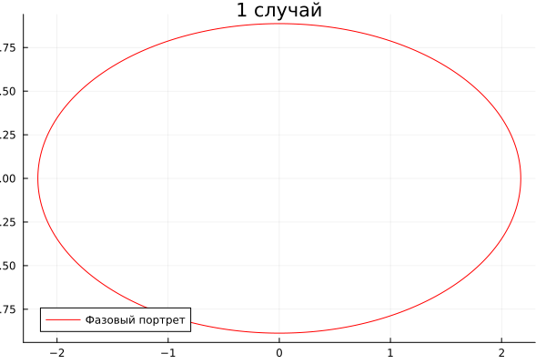
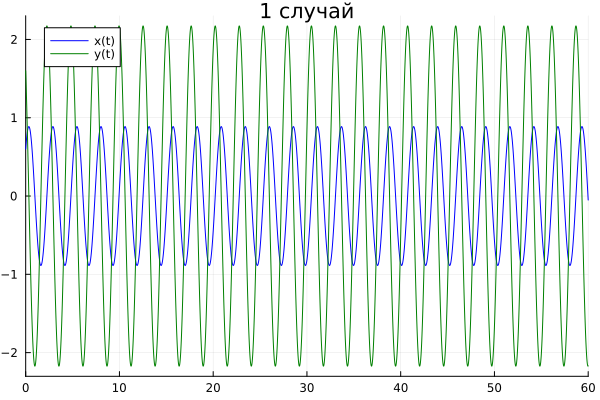
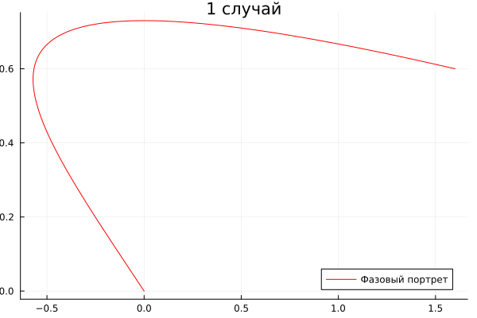
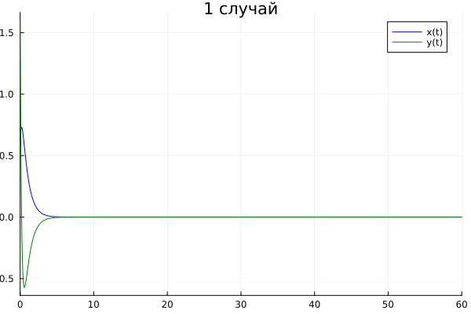
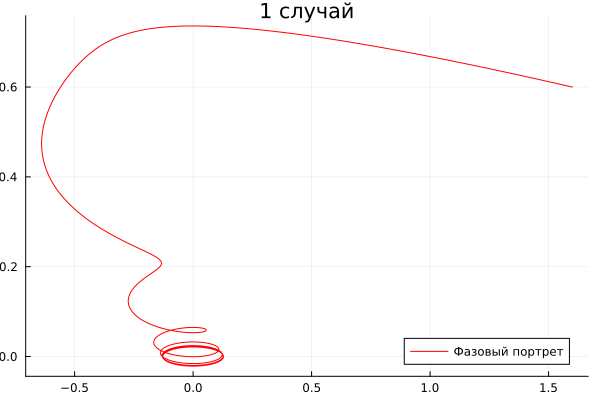
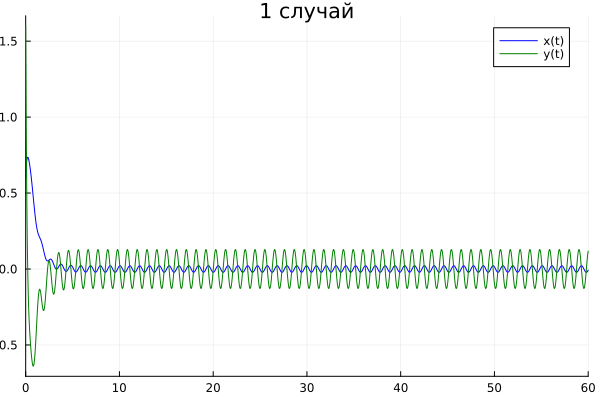

---
## Front matter
title: "Презентация по лабораторной работе №4"
subtitle: "НКНбд-01-21"
author: "Юсупов Эмиль Артурович"

## Generic otions
lang: ru-RU

## Formatting
toc: false
slide_level: 2
theme: metropolis
header-includes: 
 - \metroset{progressbar=frametitle,sectionpage=progressbar,numbering=fraction}
 - '\makeatletter'
 - '\beamer@ignorenonframefalse'
 - '\makeatother'
aspectratio: 43
section-titles: true
---

# Введение

## Теоретическое введение

Движение грузика на пружинке, маятника, заряда в электрическом контуре, а также эволюция во времени многих систем в физике, химии, биологии и других науках при определенных предположениях можно описать одним и тем же дифференциальным уравнением, которое в теории колебаний выступает в качестве основной модели. Эта модель называется линейным гармоническим осциллятором.

Уравнение свободных колебаний гармонического осциллятора имеет следующий вид:

$\ddot{x} + 2\gamma\dot{x} + \omega^2_{0}x = 0$, где x – переменная, описывающая состояние системы (смещение грузика, заряд конденсатора и т.д.), – параметр, характеризующий потери энергии (трение в механической системе, сопротивление в контуре), $\omega_0$ – собственная частота колебаний, t – время. (Обозначения $\ddot{x} = \frac{\delta^{2}x}{\delta t}, \dot{x} = \frac{\delta x}{\delta t}$)

## Теоретическое введение

При отсутствии потерь в системе ($\gamma = 0$) вместо уравнения $\ddot{x} + 2\gamma\dot{x} + \omega^2_{0}x = 0$ получаем уравнение консервативного осциллятора энергия колебания которого сохраняется во времени. 

$\ddot{x} = -\omega^2_0 x$

## Теоретическое введение

Для однозначной разрешимости уравнения второго порядка (2) необходимо задать два начальных условия вида $\ddot{x} = -\omega^2_0 x$

$\left\{ \begin{array}{cl}
x(t_0) = x_0\\
\dot{x}(t_0) = y_0
\end{array} \right.$ 

Уравнение второго порядка $\ddot{x} = -\omega^2_0 x$ можно представить в виде системы двух уравнений первого порядка:

$\left\{ \begin{array}{cl}
\dot{x} = y\\
\dot{y} = -\omega^2_0 x
\end{array} \right.$

## Теоретическое введение

Независимые переменные x, y определяют пространство, в котором «движется» решение. Это фазовое пространство системы, поскольку оно двумерно будем называть его фазовой плоскостью.

Значение фазовых координат x, y в любой момент времени полностью определяет состояние системы. Решению уравнения движения как функции времени отвечает гладкая кривая в фазовой плоскости. Она называется фазовой траекторией. Если множество различных решений (соответствующих различным  начальным условиям) изобразить на одной фазовой плоскости, возникает общая  картина поведения системы. Такую картину, образованную набором фазовых траекторий, называют фазовым портретом.

# Задание

## Задание

Вариант № 36

Постройте фазовый портрет гармонического осциллятора и решение уравнения  гармонического осциллятора для следующих случаев

1. Колебания гармонического осциллятора без затуханий и без действий внешней силы $\ddot{x} + 6x = 0$

2. Колебания гармонического осциллятора c затуханием и без действий внешней силы $\ddot{x} + 6\dot{x} + 6x = 0$

3. Колебания гармонического осциллятора c затуханием и под действием внешней силы $\ddot{x} + 6\dot{x} + 6x = \sin{6t}$

На интервале $t \in [0; 60]$ (шаг 0.05) с начальными условиями $x_0$ = 0.6, $y_0$ = 1.6

# Ход работы

## Ход работы

1. Подключил пакеты Plots, DifferentialEquations

2. Вписал начальные данные $x_0$, $y_0$, $\omega$, $\gamma$, F0(t)   

3. Написал метод F для решения заданной задачи.

4. Вывел фазовый портрет и решение уравнения гармонического осциллятора.

# Итоговые рисунки

## Итоговые рисунки

## Итоговые рисунки

## Итоговые рисунки

## Итоговые рисунки

## Итоговые рисунки

# Вывод