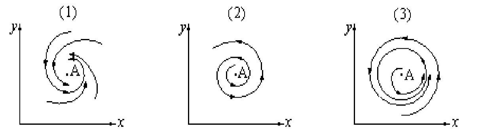
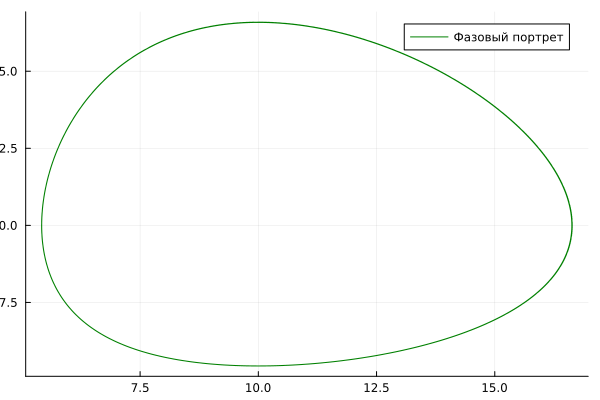
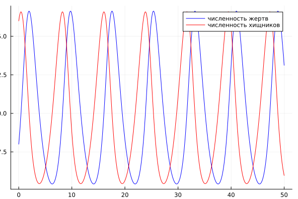

---
## Front matter
title: "Презентация по лабораторной работе №5"
subtitle: "НКНбд-01-21"
author: "Юсупов Эмиль Артурович"

## Generic otions
lang: ru-RU

## Formatting
toc: false
slide_level: 2
theme: metropolis
header-includes:
 - \metroset{progressbar=frametitle,sectionpage=progressbar,numbering=fraction}
 - '\makeatletter'
 - '\beamer@ignorenonframefalse'
 - '\makeatother'
aspectratio: 43
section-titles: true
---

# Теоретическое введение

## Модель хищник-жертва

Простейшая модель взаимодействия двух видов типа «хищник — жертва» - модель Лотки-Вольтерры. Данная двувидовая модель основывается на следующих предположениях:

1. Численность популяции жертв x и хищников y зависят только от времени  (модель не учитывает пространственное распределение популяции на занимаемой территории) 

2. В отсутствии взаимодействия численность видов изменяется по модели Мальтуса, при этом число жертв увеличивается, а число хищников падает

3. Естественная смертность жертвы и естественная рождаемость хищника считаются несущественными

4. Эффект насыщения численности обеих популяций не учитывается 

5. Скорость роста численности жертв уменьшается пропорционально численности хищников

## 

$\frac{dx}{dt} = ax(t) - bx(t)y(t)$

$\frac{dy}{dt} = -cy(t) + dx(t)y(t)$

В этой модели x – число жертв, y - число хищников. Коэффициент a описывает скорость естественного прироста числа жертв в отсутствие хищников, с - естественное вымирание хищников, лишенных пищи в виде жертв. Вероятность  взаимодействия жертвы и хищника считается пропорциональной как количеству жертв, так и числу самих хищников (xy). Каждый акт взаимодействия уменьшает  популяцию жертв, но способствует увеличению популяции хищников (члены -bxy и dxy в правой части уравнения).

##

{ #fig:001 width=70% }

## 

Математический анализ этой (жесткой) модели показывает, что имеется стационарное состояние (A на рис. [-@fig:001]), всякое же другое начальное состояние (B) приводит к периодическому колебанию численности как жертв, так и хищников, так что по прошествии некоторого времени система возвращается в состояние B. 

Стационарное состояние системы (1) (положение равновесия, не зависящее от времени решение) будет в точке: $x_0 = \frac{c}{d}$, $y_0= \frac{a}{b}$. Если начальные значения
задать в стационарном состоянии $x(0) = x_0$, $y(0) = y_0$, то в любой момент времени численность популяций изменяться не будет. При малом отклонении от положения равновесия численности как хищника, так и жертвы с течением времени не возвращаются к равновесным значениям, а совершают периодические колебания вокруг стационарной точки. Амплитуда колебаний и их период определяется начальными значениями численностей $x(0), y(0)$. Колебания совершаются в противофазе. 

##

При малом изменении модели

$\frac{dx}{dt} = ax(t) -bx(t)y(t) + \epsilon f(x,y)$

$\frac{dy}{dt} = -cy(t) + dx(t)y(t) + \epsilon g(x,y), \epsilon \ll 1$

(прибавление к правым частям малые члены, учитывающие, например,конкуренцию жертв за пищу и хищников за жертв), вывод о периодичности (возвращении системы в исходное состояние B), справедливый для жесткой системы Лотки-Вольтерры, теряет силу. Таким образом, мы получаем так называемую мягкую модель «хищник-жертва». В зависимости от вида малых поправок f и g возможны следующие сценарии 1-3 рис. [-@fig:002]

## 

{ #fig:002 width=70% }

##

В случае 1 равновесное состояние A устойчиво. При любых других начальных условиях через большое время устанавливается именно оно.

В случае 2 система стационарное состояние неустойчиво. Эволюция  приводит то к резкому увеличению числа хищников, то к их почти полному вымиранию. Такая система в конце концов попадает в область столь больших или столь малых значений x и y, что модель перестает быть применимой.

В случае 3 в системе с неустойчивым стационарным состоянием A с течением времени устанавливается периодический режим. В отличие от исходной жесткой модели Лотки-Вольтерры, в этой модели установившийся периодический режим не зависит от начального условия. Первоначально незначительное отклонение от стационарного состояния A приводит не к малым колебаниям около A, как в модели Лотки-Вольтерры, а к колебаниям вполне определенной (и не зависящей от малости отклонения) амплитуды. 

## 

Вывод: жесткую модель всегда надлежит исследовать на структурную устойчивость полученных при ее изучении результатов по отношению к малым изменениям модели (делающим ее мягкой).

# Задание

## Вариант 36

Для модели «хищник-жертва»:

$\left\{ \begin{array}{cl}   
\frac{dx}{dt} = -0.83x(t) + 0.083x(t)y(t) \\
\frac{dy}{dt} = 0.82- 0.082x(t)y(t)
\end{array} \right.$

Постройте график зависимости численности хищников от численности жертв, а также графики изменения численности хищников и численности жертв при  следующих начальных условиях:$x_0 = 8, y_0 = 16$. Найдите стационарное состояние системы. 

# Резульаты работы

## Резульаты работы

## Резульаты работы

## Результат работы

# Вывод