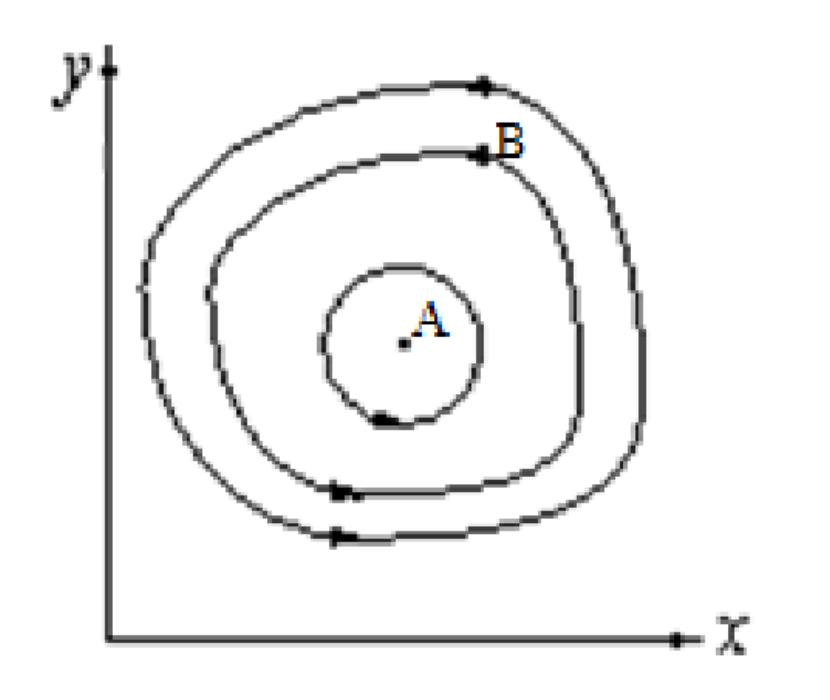
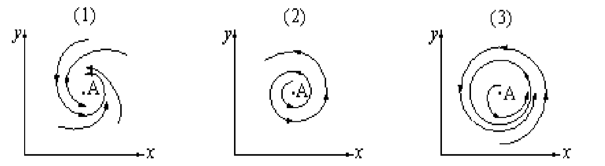
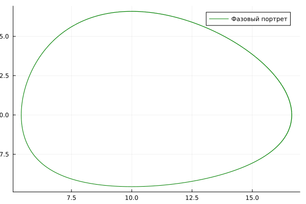
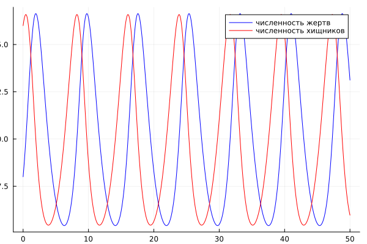
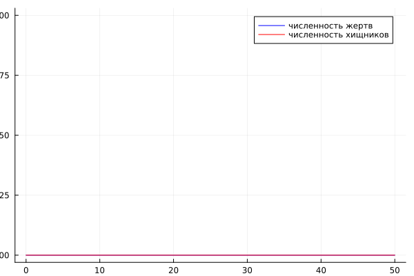

---
## Front matter
title: "Отчёт по лабораторной работе №5"
subtitle: "НКНбд-01-21"
author: "Юсупов Эмиль Артурович"

## Generic otions
lang: ru-RU
toc-title: "Содержание"

## Bibliography
bibliography: bib/cite.bib
csl: pandoc/csl/gost-r-7-0-5-2008-numeric.csl

## Pdf output format
toc: true # Table of contents
toc-depth: 2
fontsize: 12pt
linestretch: 1.5
papersize: a4
documentclass: scrreprt
## I18n polyglossia
polyglossia-lang:
  name: russian
  options:
        - spelling=modern
        - babelshorthands=true
polyglossia-otherlangs:
  name: english
## I18n babel
babel-lang: russian
babel-otherlangs: english
## Fonts
mainfont: PT Serif
romanfont: PT Serif
sansfont: PT Sans
monofont: PT Mono
mainfontoptions: Ligatures=TeX
romanfontoptions: Ligatures=TeX
sansfontoptions: Ligatures=TeX,Scale=MatchLowercase
monofontoptions: Scale=MatchLowercase,Scale=0.9
## Biblatex
biblatex: true
biblio-style: "gost-numeric"
biblatexoptions:
  - parentracker=true
  - backend=biber
  - hyperref=auto
  - language=auto
  - autolang=other*
  - citestyle=gost-numeric
## Pandoc-crossref LaTeX customization
figureTitle: "Рис."
tableTitle: "Таблица"
listingTitle: "Листинг"
lofTitle: "Цель Работы"
lotTitle: "Ход Работы"
lolTitle: "Листинги"
## Misc options
indent: true
header-includes:
  - \usepackage{indentfirst}
  - \usepackage{float} # keep figures where there are in the text
  - \floatplacement{figure}{H} # keep figures where there are in the text
---

# Теоретическое введение

## Модель хищник-жертва

Простейшая модель взаимодействия двух видов типа «хищник — жертва» - модель Лотки-Вольтерры. Данная двувидовая модель основывается на следующих предположениях:

1. Численность популяции жертв x и хищников y зависят только от времени  (модель не учитывает пространственное распределение популяции на занимаемой территории) 

2. В отсутствии взаимодействия численность видов изменяется по модели Мальтуса, при этом число жертв увеличивается, а число хищников падает

3. Естественная смертность жертвы и естественная рождаемость хищника считаются несущественными

4. Эффект насыщения численности обеих популяций не учитывается 

5. Скорость роста численности жертв уменьшается пропорционально численности хищников

$\frac{dx}{dt} = ax(t) - bx(t)y(t)$

$\frac{dy}{dt} = -cy(t) + dx(t)y(t)$


В этой модели x – число жертв, y - число хищников. Коэффициент a описывает скорость естественного прироста числа жертв в отсутствие хищников, с - естественное вымирание хищников, лишенных пищи в виде жертв. Вероятность  взаимодействия жертвы и хищника считается пропорциональной как количеству жертв, так и числу самих хищников (xy). Каждый акт взаимодействия уменьшает  популяцию жертв, но способствует увеличению популяции хищников (члены -bxy и dxy в правой части уравнения).

{ #fig:001 width=70% }

Математический анализ этой (жесткой) модели показывает, что имеется стационарное состояние (A на рис. [-@fig:001]), всякое же другое начальное состояние (B) приводит к периодическому колебанию численности как жертв, так и хищников, так что по прошествии некоторого времени система возвращается в состояние B. 

Стационарное состояние системы (1) (положение равновесия, не зависящее от времени решение) будет в точке: $x_0 = \frac{c}{d}$, $y_0= \frac{a}{b}$. Если начальные значения
задать в стационарном состоянии $x(0) = x_0$, $y(0) = y_0$, то в любой момент времени численность популяций изменяться не будет. При малом отклонении от положения равновесия численности как хищника, так и жертвы с течением времени не возвращаются к равновесным значениям, а совершают периодические колебания вокруг стационарной точки. Амплитуда колебаний и их период определяется начальными значениями численностей $x(0), y(0)$. Колебания совершаются в противофазе. 

При малом изменении модели

$\frac{dx}{dt} = ax(t) -bx(t)y(t) + \epsilon f(x,y)$

$\frac{dy}{dt} = -cy(t) + dx(t)y(t) + \epsilon g(x,y), \epsilon \ll 1$

(прибавление к правым частям малые члены, учитывающие, например,конкуренцию жертв за пищу и хищников за жертв), вывод о периодичности (возвращении системы в исходное состояние B), справедливый для жесткой системы Лотки-Вольтерры, теряет силу. Таким образом, мы получаем так называемую мягкую модель «хищник-жертва». В зависимости от вида малых поправок f и g возможны следующие сценарии 1-3 рис. [-@fig:002]

{ #fig:002 width=70% }

В случае 1 равновесное состояние A устойчиво. При любых других начальных условиях через большое время устанавливается именно оно.

В случае 2 система стационарное состояние неустойчиво. Эволюция  приводит то к резкому увеличению числа хищников, то к их почти полному вымиранию. Такая система в конце концов попадает в область столь больших или столь малых значений x и y, что модель перестает быть применимой.

В случае 3 в системе с неустойчивым стационарным состоянием A с течением времени устанавливается периодический режим. В отличие от исходной жесткой модели Лотки-Вольтерры, в этой модели установившийся периодический режим не зависит от начального условия. Первоначально незначительное отклонение от стационарного состояния A приводит не к малым колебаниям около A, как в модели Лотки-Вольтерры, а к колебаниям вполне определенной (и не зависящей от малости отклонения) амплитуды. Возможны и другие структурно устойчивые сценарии (например, с несколькими периодическими режимами).

Вывод: жесткую модель всегда надлежит исследовать на структурную устойчивость полученных при ее изучении результатов по отношению к малым изменениям модели (делающим ее мягкой).

В случае модели Лотки-Вольтерры для суждения о том, какой же из сценариев 1-3 (или иных возможных) реализуется в данной системе, совершенно необходима дополнительная информация о системе (о виде малых поправок f и g в нашей формуле). Математическая теория мягких моделей указывает, какую именно информацию для этого нужно иметь. Без этой информации жесткая модель может привести к качественно ошибочным предсказаниям. Доверять выводам, сделанным на основании жесткой модели, можно лишь тогда, когда они подтверждаются исследованием их структурной устойчивости

# Задание

## Вариант 36

Для модели «хищник-жертва»:

$\left\{ \begin{array}{cl}   
\frac{dx}{dt} = -0.83x(t) + 0.083x(t)y(t) \\
\frac{dy}{dt} = 0.82- 0.082x(t)y(t)
\end{array} \right.$

Постройте график зависимости численности хищников от численности жертв, а также графики изменения численности хищников и численности жертв при  следующих начальных условиях:$x_0 = 8, y_0 = 16$. Найдите стационарное состояние системы. 

# Ход работы

Построили график зависимости численности хищников от численности жертв и график изменения численности хищников и численности жертв.

``` julia
using Plots
using DifferentialEquations

x0 = 8
y0 = 16

function F(du, u, p, t)
    du[1] = -0.83*u[1] + 0.083*u[1]*u[2]
    du[2] = 0.82*u[2] - 0.082*u[1]*u[2]
end

u0=[x0,y0]
t = (0,50)
prob = ODEProblem(F, u0, t)
solv = solve(prob, dtmax = 0.1)

A1 = [u[1] for u in solv.u]
A2 = [u[2] for u in solv.u]
T =  [t for t in solv.t]

plt = plot(legend=true, label="зависимости численности хищников от численности жертв")
plot!(plt, A1, A2, color=:green, label= "Фазовый портрет", ylabel="Хищники", xlabel="Жертвы")

savefig(plt, "1.png")

plt = plot(legend=true, label="изменения численности хищников и численности жертв")
plot!(plt, T, A1, label = "численность жертв", color=:blue)
plot!(plt, T, A2, label = "численность хищников", color=:red)

savefig(plt, "2.png")

x0 = 0.82/0.082
y0 = 0.83/0.083

u0=[x0,y0]
t = (0,50)
prob = ODEProblem(F, u0, t)
solv = solve(prob, dtmax = 0.1)

A1 = [u[1] for u in solv.u]
A2 = [u[2] for u in solv.u]
T =  [t for t in solv.t]

plt = plot(legend=true, label="изменения численности хищников и численности жертв")
plot!(plt, T, A1, label = "численность жертв", color=:blue)
plot!(plt, T, A2, label = "численность хищников", color=:red)

savefig(plt, "3.png")
```

# Резульаты работы








# Вывод

Во время выполнения лабораторной работы мы познакомились с моделью Лотки-Вольтерры "Хищник-Жертва".