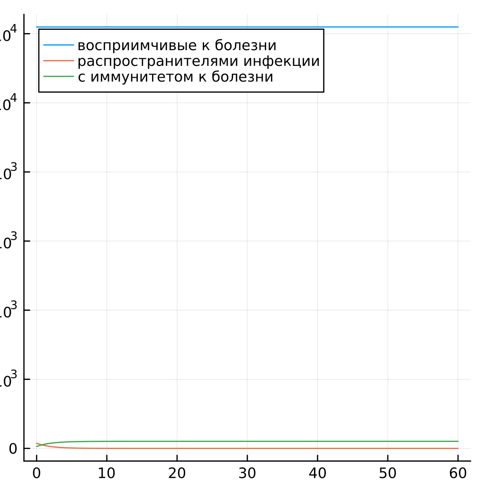
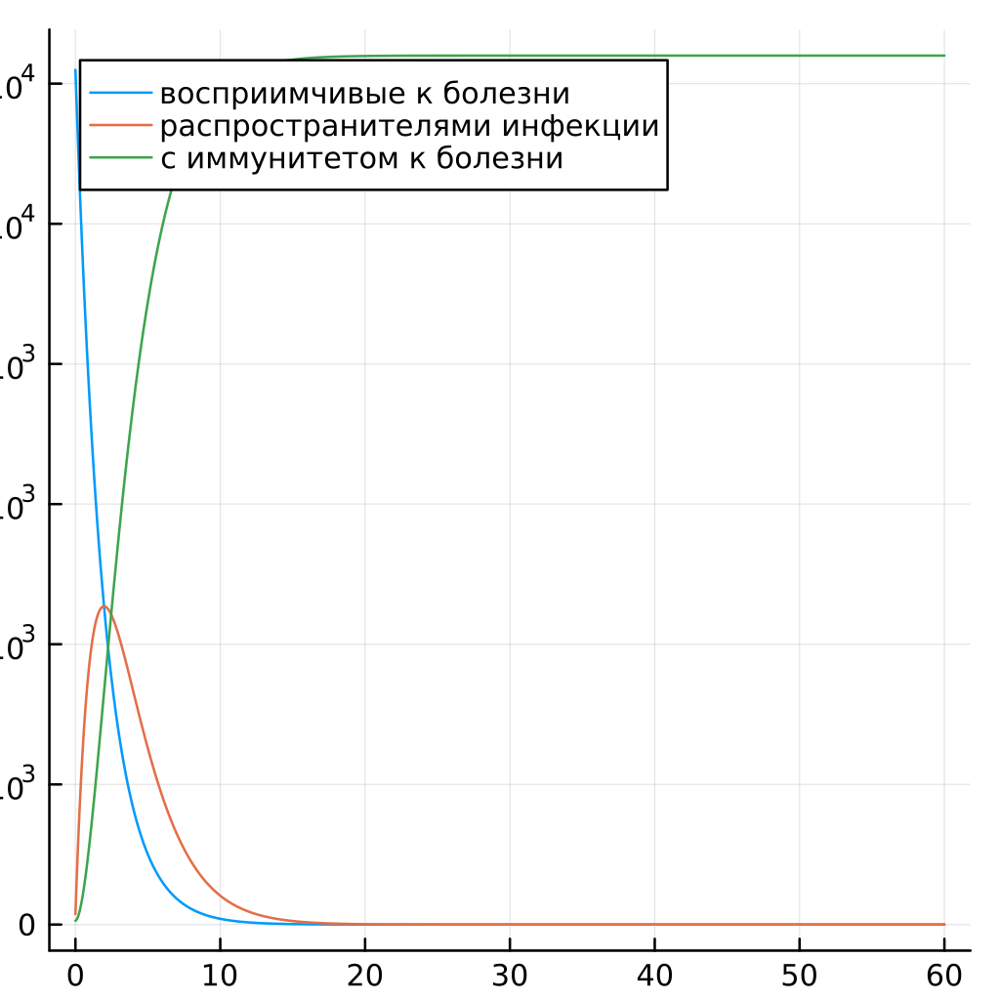

---
## Front matter
title: "Презентация по лабораторной работе №6"
subtitle: "НКНбд-01-21"
author: "Юсупов Эмиль Артурович"

## Generic otions
lang: ru-RU

## Formatting
toc: false
slide_level: 2
theme: metropolis
header-includes:
 - \metroset{progressbar=frametitle,sectionpage=progressbar,numbering=fraction}
 - '\makeatletter'
 - '\beamer@ignorenonframefalse'
 - '\makeatother'
aspectratio: 43
section-titles: true
---

# Теоретическое введение

## Задача об эпидемии

Рассмотрим простейшую модель эпидемии. Предположим, что некая популяция, состоящая из N особей, (считаем, что популяция изолирована) подразделяется на три группы. Первая группа - это восприимчивые к болезни, но пока здоровые особи, обозначим их через $S(t)$. Вторая группа – это число инфицированных особей, которые также при этом являются распространителями инфекции, обозначим их $I(t)$. А третья группа, обозначающаяся через $R(t)$ – это здоровые особи с иммунитетом к болезни.

До того, как число заболевших не превышает критического значения  I*, считаем, что все больные изолированы и не заражают здоровых. Когда $I(t) > I^{*}$,
тогда инфицирование способны заражать восприимчивых к болезни особей.

## 

Таким образом, скорость изменения числа S(t) меняется по следующему закону:

$\frac{dS}{dt} = \left\{ \begin{array}{cl}
-\alpha S & : \ I(t) > I^{*} \\
0 & : \ I(t) <=  I^{*}
\end{array} \right.$

## 

Поскольку каждая восприимчивая к болезни особь, которая, в конце концов, заболевает, сама становится инфекционной, то скорость изменения числа инфекционных особей представляет разность за единицу времени между заразившимися и теми, кто уже болеет и лечится, т.е.:

$\frac{dI}{dt} = \left\{ \begin{array}{cl}
\alpha S - \beta I & : \ I(t) > I^{*} \\
-\beta I & : \ I(t) <=  I^{*}
\end{array} \right.$

А скорость изменения выздоравливающих особей (при этом приобретающие иммунитет к болезни)

$\frac{dR}{dt} = \beta I$

# Ход работы

## Решение и листинг

1) Инициализируем пакеты и константы

```julia
using Plots
using DifferentialEquations

const N = 12400
const I0 = 150
const R0 = 55
const S0 = N - I0 - R0
const alpha = 0.5
const beta = 0.5
```

##

2) Инициализируем функции для двух случаев

```julia
function epidemic(du, u, p, t)
    S, I, R = u
    du[1] = 0
    du[2] = -beta* u[2]
    du[3]= beta * u[2]
end

function epidemic(du, u, p, t)
    S, I, R = u
    du[1] = -alpha*u[1]
    du[2] = alpha*u[1]-beta* u[2]
    du[3]= beta * u[2]
end
```

## 

3) Решение и отображение

```julia
v0 = [S0, I0, R0]
prom = (0.0, 60.0)
prob = ODEProblem(epidemic, v0, prom)
solv = solve(prob, dtmax=0.05)

S = [u[1] for u in solv.u]
I = [u[2] for u in solv.u]
R = [u[3] for u in solv.u]
T = [t for t in solv.t]

plt = plot(dpi = 256,  size = (400,400))
plot!(plt, T, S, label="восприимчивые к болезни")
plot!(plt, T, I, label="распространителями инфекции")
plot!(plt, T, R, label="c иммунитетом к болезни")

savefig(plt, "img/main-1.png")
```

# Результаты работы


##



##



# Вывод