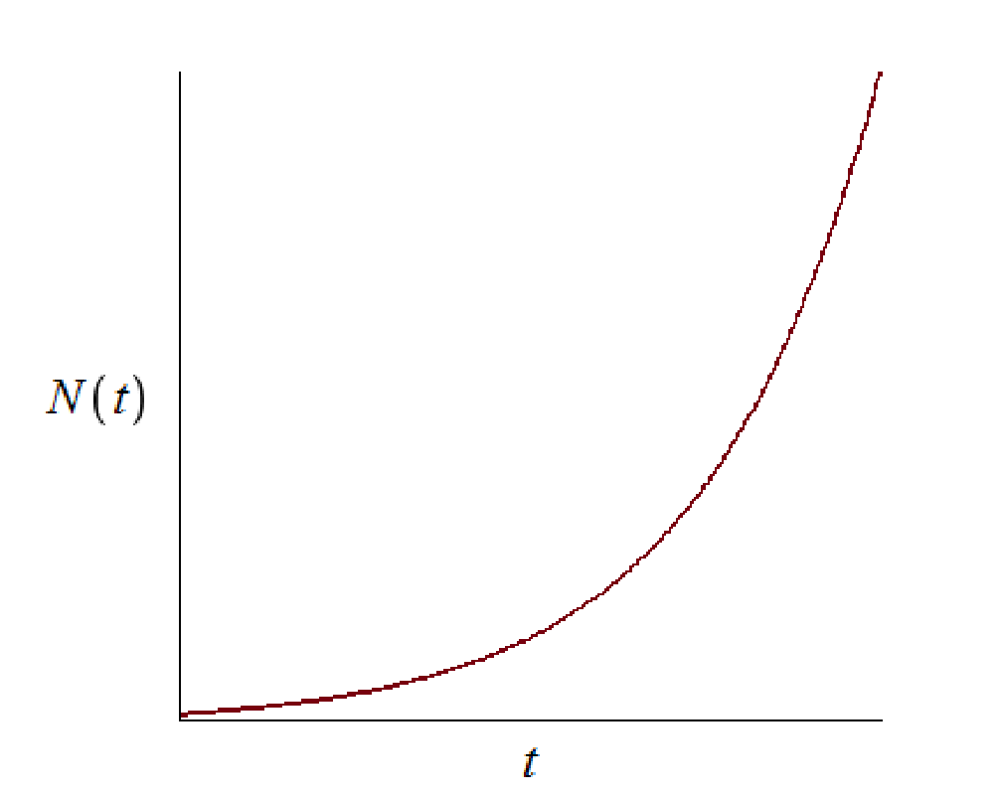
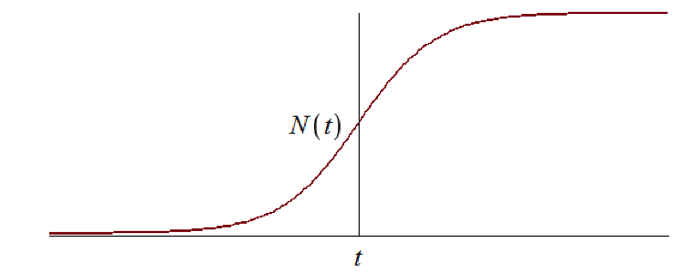
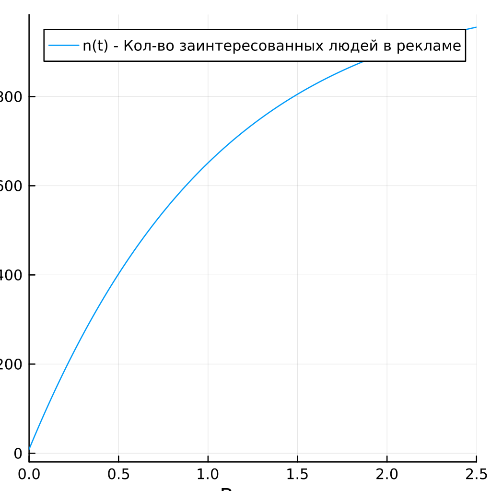
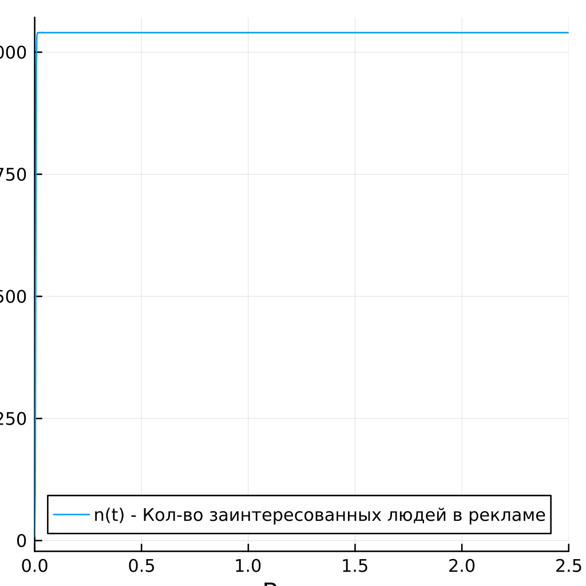
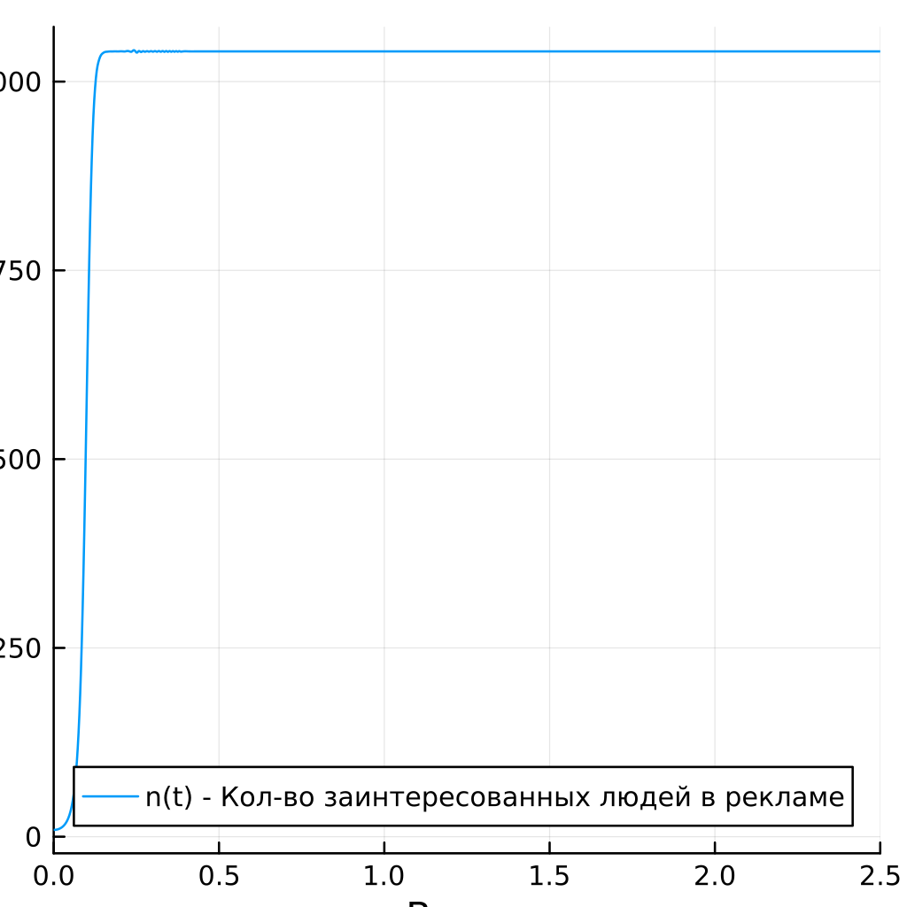

---
## Front matter
title: "Презентация по лабораторной работе №7"
subtitle: "НКНбд-01-21"
author: "Юсупов Эмиль Артурович"

## Generic otions
lang: ru-RU

## Formatting
toc: false
slide_level: 2
theme: metropolis
header-includes:
 - \metroset{progressbar=frametitle,sectionpage=progressbar,numbering=fraction}
 - '\makeatletter'
 - '\beamer@ignorenonframefalse'
 - '\makeatother'
aspectratio: 43
section-titles: true
---

# Теоретическое введение

## Эффективность рекламы

Организуется рекламная кампания нового товара или услуги. Необходимо,чтобы прибыль будущих продаж с избытком покрывала издержки на рекламу. Вначале расходы могут превышать прибыль, поскольку лишь малая частьпотенциальных покупателей будет информирована о новинке. Затем, при увеличении числа продаж, возрастает и прибыль, и, наконец, наступит момент, когда рынок насытиться, и рекламировать товар станет бесполезным.

## 

Предположим, что торговыми учреждениями реализуется некоторая продукция, о которой в момент времениt из числа потенциальных покупателей N знает лишь n покупателей. Для ускорения сбыта продукции запускается реклама по радио, телевидению и других средств массовой информации. После запуска рекламной кампании информация о продукции начнет распространяться среди потенциальных покупателей путем общения друг с другом. Таким образом, после запуска рекламных объявлений скорость изменения числа знающих о продукции людей пропорциональна как числу знающих о товаре покупателей, так и числу покупателей о нем не знающих.

## 

Модель рекламной кампании описывается следующими величинами. Считаем, что $\frac{dn}{dt}$ - скорость изменения со временем числа потребителей, узнавших о товаре и готовых его купить, $t$ - время, прошедшее с начала рекламной кампании,$n(t)$ - число уже информированных клиентов. Эта величина пропорциональна числу покупателей, еще не знающих о нем, это описывается следующим образом: $\alpha_{1}(t)(N-n(t))$, где N - общее число потенциальных платежеспособных покупателей, $\alpha_{1}(t) > 0$ - характеризует интенсивность рекламной кампании (зависит от затрат на рекламу в данный момент времени). Помимо этого, узнавшие о товаре потребители также распространяют полученную информацию среди потенциальных покупателей, не знающих о нем (в этом случае работает т.н. сарафанное радио). Этот вклад в рекламу описывается величиной $\alpha_{2}(t)n(t)(N-n(t))$, эта величина увеличивается с увеличением потребителей узнавших о товаре. Математическая модель распространения рекламы описывается уравнением:

$\frac{dn}{dt} = (\alpha_{1}(t) + \alpha_{2}(t)n(t))(N-n(t))$

## 


При $\alpha_{1}(t) >> \alpha_{2}(t)$ получается модель типа модели Мальтуса, решение которой имеет вид.

## 

{}

##

В обратном случае, при $\alpha_{1}(t) << \alpha_{2}(t)$ получаем уравнение логистической кривой:

## 



# Задание

## Вариант 36

Постройте график распространения рекламы, математическая модель которой описывается следующим уравнением:

1. $\frac{dn}{dt} = (0.94 + 0.000094n(t))(N-n(t))$

2. $\frac{dn}{dt} = (0.000094n + 0.94n(t))(N-n(t))$

3. $\frac{dn}{dt} = (0.94\sin(t) + 0.94\sin(t)n(t))(N-n(t))$

При этом объем аудитории N = 1040 , в начальный момент о товаре знает 9 человек. Для случая 2 определите в какой момент времени скорость распространения рекламы будет иметь максимальное значение.

# Ход работы

## Инициализация пакетов и констант

```julia
using Plots
using DifferentialEquations

const N = 1040
const n0 = [9]
const alpha = 0.94
const beta = 0.000094 
const t = (0, 2.5)
```

## Прописывание функций

```julia
function AD(du, u, p, t)
    du[1] = (alpha + beta*u[1])*(N - u[1])
end

function AD(du, u, p, t)
    du[1] = (beta + alpha*u[1])*(N - u[1])
end

function AD(du, u, p, t)
    du[1] = (alpha*sin(t) + alpha * sin(t) * u[1])*(N - u[1])
end
```

## Решение и получение графиков

```julia
prob = ODEProblem(AD, n0, t)
solv = solve(prob, dtmax=0.5)

plt = plot(
    solv,
    dpi = 256,
    size = (400,400),
    xlabel="Время",
    ylabel="n(t)",
    label="n(t) - Кол-во заинтересованных людей в рекламе"
)

savefig(plt, "img/n.png")
```

# Результаты программы

##



## 



##



# Вывод