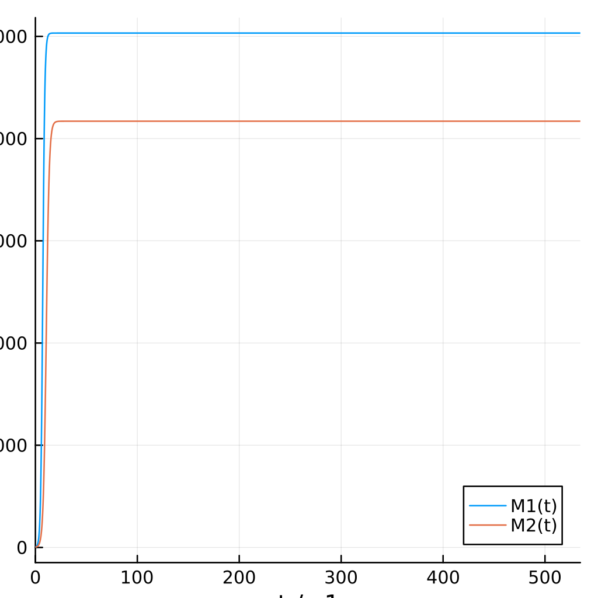

---
## Front matter
title: "Отчёт по лабораторной работе №8"
subtitle: "НКНбд-01-21"
author: "Юсупов Эмиль Артурович"

## Generic otions
lang: ru-RU
toc-title: "Содержание"

## Bibliography
bibliography: bib/cite.bib
csl: pandoc/csl/gost-r-7-0-5-2008-numeric.csl

## Pdf output format
toc: true # Table of contents
toc-depth: 2
fontsize: 12pt
linestretch: 1.5
papersize: a4
documentclass: scrreprt
## I18n polyglossia
polyglossia-lang:
  name: russian
  options:
        - spelling=modern
        - babelshorthands=true
polyglossia-otherlangs:
  name: english
## I18n babel
babel-lang: russian
babel-otherlangs: english
## Fonts
mainfont: PT Serif
romanfont: PT Serif
sansfont: PT Sans
monofont: PT Mono
mainfontoptions: Ligatures=TeX
romanfontoptions: Ligatures=TeX
sansfontoptions: Ligatures=TeX,Scale=MatchLowercase
monofontoptions: Scale=MatchLowercase,Scale=0.9
## Biblatex
biblatex: true
biblio-style: "gost-numeric"
biblatexoptions:
  - parentracker=true
  - backend=biber
  - hyperref=auto
  - language=auto
  - autolang=other*
  - citestyle=gost-numeric
## Pandoc-crossref LaTeX customization
figureTitle: "Рис."
tableTitle: "Таблица"
listingTitle: "Листинг"
lofTitle: "Цель Работы"
lotTitle: "Ход Работы"
lolTitle: "Листинги"
## Misc options
indent: true
header-includes:
  - \usepackage{indentfirst}
  - \usepackage{float} # keep figures where there are in the text
  - \floatplacement{figure}{H} # keep figures where there are in the text
---

# Введение

## Цель работы

- Рассмотреть модель конкурирующих фирм. 

- Построить реализацию модели на Julia

# Ход работы

## Задание

### Вариант 36

Случай 1. Рассмотрим две фирмы, производящие взаимозаменяемые товары одинакового качества и находящиеся в одной рыночной нише. Считаем, что в рамках нашей модели конкурентная борьба ведётся только рыночными методами. То есть, конкуренты могут влиять на противника путем изменения параметров своего производства: себестоимость, время цикла, но не могут прямо вмешиваться в ситуацию на рынке («назначать» цену или влиять на потребителей каким-либо иным способом.) Будем считать, что постоянные издержки пренебрежимо малы, и в модели учитывать не будем. В этом случае динамика изменения объемов продаж фирмы 1 и фирмы 2 описывается следующей системой уравнений:

$\frac{dM_1}{d\theta} = M_1 - \frac{b}{c_1}M_{1}M_{2} - \frac{a_1}{c_1}M^2_1$

$\frac{dM_2}{d\theta} = \frac{c_2}{c_1}M_1 - \frac{b}{c_1}M_{1}M_{2} - \frac{a_2}{c_1}M^2_2$,  

где $a_1 = \frac{p_{cr}}{\tau^2_1 p^2_1 Nq}$, $a_2 = \frac{p_{cr}}{\tau^2_2 p^2_2 Nq}$, $b = \frac{p_{cr}}{\tau^2_1 p^2_1 \tau^2_2 p^2_2 Nq}$, $c_1 = \frac{p_{cr} - p_1}{\tau^2_1 p^2_1}$, $c_2 = \frac{p_{cr} - p_2}{\tau^2_2 p^2_2}$, также введлена нормировка $t = c_1 \theta$

Случай 2. Рассмотрим модель, когда, помимо экономического фактора влияния (изменение себестоимости, производственного цикла, использование кредита и т.п.), используются еще и социально-психологические факторы – формирование общественного предпочтения одного товара другому, не зависимо от их качества и цены. В этом случае взаимодействие двух фирм будет зависеть друг от друга, соответственно коэффициент перед1 2M M будет отличаться. Пусть в рамках рассматриваемой модели динамика изменения объемов продаж фирмы 1 и фирмы 2 описывается следующей системой уравнений:

$\frac{dM_1}{d\theta} = M_1 - \frac{b}{c_1}M_{1}M_{2} - \frac{a_1}{c_1}M^2_1$

$\frac{d M_2}{d \theta} = (\frac{c_2}{c_1} + 0.00063)M_1 - \frac{b}{c_1}M_{1}M_{2} - \frac{a_2}{c_1}M^2_2$,  

Для обоих случаев рассмотрим задачу со следующими начальными условиями и параметрами:

$M^1_0 = 3.7, M^2_0 = 2.8, p_{cr} = 27, N = 37, q = 1, \tau_1 = 27, \tau_2 = 17, p_1 = 6.7, p_2 = 11.7$

## Выполнение

1. Введем константы и начальные пакеты для работы

```julia
using Plots
using DifferentialEquations

const M1_0 = 3.7
const M2_0 = 2.8
const p_cr = 27
const N = 37
const q = 1
const tau1 = 27
const tau2 = 17
const p1 = 6.7
const p2 = 11.7

const a1 = p_cr / (tau1^2 * p1^2 * N * q)
const a2 = p_cr / (tau2^2 * p2^2 * N * q)
const b = p_cr / (tau1^2 * p1^2 * tau2^2 * p2^2 * N * q)
const c1 = (p_cr - p1) / (tau1 * p1)
const c2 = (p_cr - p2) / (tau2 * p2)
```

2. Введем функции

```julia

function F(dm, m, p, t)
    dm[1] = m[1] - (b/c1)*m[1]*m[2] - (a1/c1)*m[1]^2
    dm[2] = (c2/c1)*m[2] - (b/c1)*m[1]*m[2] - (a2/c1)*m[2]^2
end

function F(dm, m, p, t)
    dm[1] = m[1] - (b/c1)*m[1]*m[2] - (a1/c1)*m[1]^2
    dm[2] = (c2/c1)*m[2] - (b/c1 + 0.00063)*m[1]*m[2] - (a2/c1)*m[2]^2
end
```

3. Выведем графики на фотографию

```julia
prob = ODEProblem(F, m0, t)
solv = solve(prob)

plt = plot(
    solv,    
    dpi=256,
    size=(400,400),
    xlabel = "t / c1",
    ylabel = "M1, M2",
    label = ["M1(t)" "M2(t)"]    
)

savefig(plt, "img/second.png")
```

## Результаты

{ #fig:001 width=70% }

{ #fig:002 width=70% }

# Вывод

Во время выполнения лабораторной работы, мы познакомились с моделью конкурирующих фирм.

